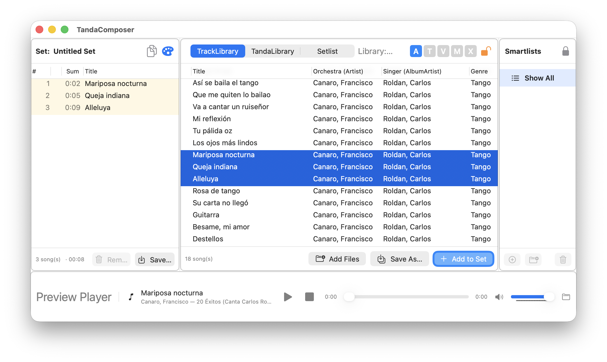

# TandaComposer

TandaComposer is a macOS application for creating, organizing and maintaining tango dance music Setlists.



It is designed for DJs and dancers who want to prepare Setlists from their own music collection, organize tracks into Tandas, and keep their music library manageable.

## Requirements

- **Mac with Apple Silicon — M1 or later**
- macOS 15.6 or later
- Xcode
- A music collection accessible from the Mac

## What you can do

- Build Setlists from individual tracks
- Reuse tracks from previously saved Setlists
- Add prepared Tandas to a Setlist
- Import a Setlist from an M3U8 file (experimental)
- Organize Tandas in folders and Smartlists
- Filter tracks by dance type
- Create Smartlists to find tracks matching specific criteria
- Preview tracks while preparing a Setlist
- See how Tandas in your Setlist are distributed across orchestras
- Save and export Setlists
- Work with multiple, independent Track Libraries
- Check and maintain the music Library
- Find duplicate tracks and clean up missing file references

## Music and Library

Before building Setlists, you add the folders containing your music to the Track Library.

TandaComposer scans these folders and creates its own Library information for the tracks it finds. The Library keeps track of the music files and their locations; the audio files themselves are not copied into the Library.

### Music files are never modified

**TandaComposer does not write tags or other metadata into your music files.**

Your original audio files remain unchanged. TandaComposer maintains its own Library information separately from the music files.

Organizing tracks, creating Tandas, building Setlists or using Smartlists does **not** modify the tags of your audio files.

## Setlists

The Setlist is the central workspace in TandaComposer.

You can build a Setlist in several ways:

- Add individual tracks from the Track Library
- Select several tracks and add them to the Setlist
- Reuse tracks from previously saved Setlists
- Add prepared Tandas from the Tanda Library

Once tracks or Tandas have been added, you can arrange and modify the Setlist as needed.

## Tandas

A Tanda is a group of tracks that the user has chosen to work well together.

TandaComposer does **not** automatically decide which tracks form a good Tanda.

Tandas are created and maintained by the user and can then be reused when building Setlists.

Tandas can be organized in folders and Smartlists to make them easier to find.

## Smartlists

Smartlists allow you to narrow down the tracks or Tandas displayed in a Library.

For example, a Track Smartlist can be used to show only tracks by a particular orchestra, or to combine criteria such as orchestra and singer.

Smartlists are especially useful when working with a large music collection.

## Project structure

The main parts of the project are organized as follows:

- `TandaComposer/` — main application UI and commands
- `TandaCore/` — core data, Library and Setlist functionality
- `TandaLibrary/` — Tanda management
- `TandaSmart/` — Smartlists
- `TandaPreviewPlayer/` — audio preview
- `TandaDuplicates/` — duplicate detection
- `TandaTools/` — maintenance and Library tools
- `AudioTagKit/` — audio metadata handling
- `TandaKit/` — shared utilities
- `Help/` — built-in user documentation
- `Third-Party_Notices/` — third-party software notices and licenses

## Building

Open the Xcode project:

```text
TandaComposer.xcodeproj
```

Select the appropriate target and build the application in Xcode.

The repository also contains build scripts for creating application/package builds, under `scripts/`:

```text
scripts/build.sh
scripts/build_pkg.sh
```

## Documentation

The built-in user documentation is located in:

```text
Help/help_en.html
```

The `Help` folder also contains the screenshots used by the documentation.

## Changelog

See [CHANGELOG.md](CHANGELOG.md) for release notes.

## License

TandaComposer is licensed under the **GNU General Public License v3.0**.

See:

```text
LICENSE
```

## Third-party software

TandaComposer uses third-party software components. Their notices and licenses are included in:

```text
Third-Party_Notices/
```

In particular, the project includes **GRDB**, which is distributed under the MIT License.

See:

```text
Third-Party_Notices/GRDB.txt
Third-Party_Notices/LICENSE_MIT
```