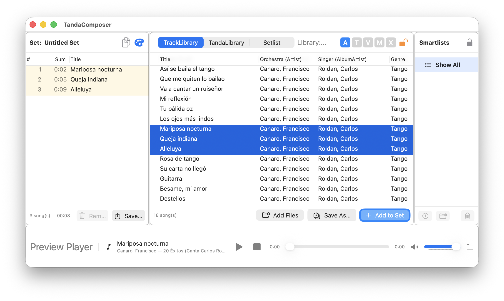
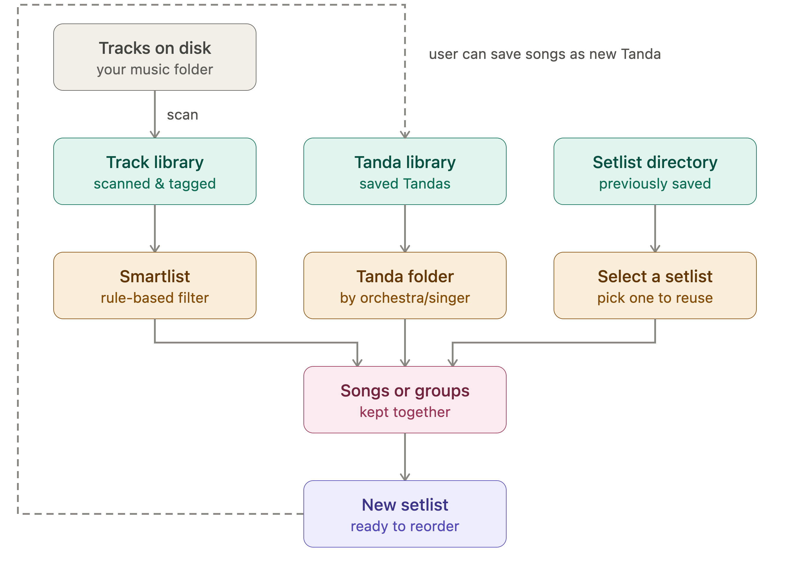

# TandaComposer

TandaComposer is a macOS application for creating, organizing and maintaining tango dance music Setlists.



It is designed for DJs and dancers who want to prepare Setlists from their own music collection, organize tracks into Tandas, and keep their music library manageable.

## Requirements

- **Mac with Apple Silicon — M1 or later**
- macOS 15.6 or later
- Xcode
- A music collection accessible from the Mac

## What you can do

- Build Setlists from individual tracks
- Reuse tracks from previously saved Setlists
- Add prepared Tandas to a Setlist
- Import a Setlist from an M3U8 file (experimental)
- Edit track tags directly in the audio files (experimental — see below)
- Organize Tandas in folders and Smartlists
- Filter tracks by dance type
- Create Smartlists to find tracks matching specific criteria
- Preview tracks while preparing a Setlist
- See how Tandas in your Setlist are distributed across orchestras
- Save and export Setlists
- Share your Tandas: export them as one text or M3U8 file per Tanda in a ZIP, and import such a ZIP into another TrackLibrary (experimental)
- Work with multiple, independent Track Libraries
- Check and maintain the music Library
- Find duplicate tracks and clean up missing file references

## Import and export

All import and export commands are in the **Tools** menu (the Setlist menu only manages Setlists):

| Tools → Export | Tools → Import |
| --- | --- |
| Current Setlist (M3U8)… | Setlist (Pick Tracks)… *(in development)* |
| Smartlists… | Setlist (M3U8, experimental)… |
| TandaLibrary for Sharing (ZIP)… | Smartlists… |
| Backup of All Data… | Tandas from ZIP… *(experimental)* |
| | Restore Backup… |

- **Backup of All Data / Restore Backup** save and restore the whole `~/.TandaComposer` folder. Restoring overwrites files with the same name, so make a backup first.
- **TandaLibrary for Sharing** writes one file per Tanda (text or M3U8), in the same folders as your TandaLibrary, into a ZIP. The ZIP contains no music, and your own files are not changed.
- **Tandas from ZIP** reads such a ZIP, one orchestra folder at a time. Each Tanda is matched with your TrackLibrary and shown as *Ready*, *Needs help*, *Already in your TandaLibrary* or *Not possible*; you check what to import. Folder and name of an imported Tanda come from your own tags. Imported Tandas can only be removed one by one.

## Music and Library

Before building Setlists, you add the folders containing your music to the Track Library.

TandaComposer scans these folders and creates its own Library information for the tracks it finds. The Library keeps track of the music files and their locations; the audio files themselves are not copied into the Library.

### Your music files stay untouched — except for Edit Tags

By default, TandaComposer does **not** change your audio files. It keeps its own Library information separately from the music files.

Organizing tracks, creating Tandas, building Setlists, using Smartlists and exporting Setlists do **not** modify the tags of your audio files.

### Edit Tags (experimental) writes into your files

**Edit Tags…** is the one feature that **modifies your audio files**: it writes Title, Orchestra (Artist), Singer (AlbumArtist), Genre, Year and Comment directly into the selected files (FLAC, MP3, M4A/AAC and AIFF) and updates the Library to match.

- It is **experimental** and has had less real-world testing than the rest of the app.
- It is available only while the Library is **unlocked**.
- Changes are written immediately. There is no Undo inside the app.
- Before the first change to a file, a copy of the original is saved next to it as `<filename>_original` (for example `track.flac_original`). An existing backup is never overwritten, and backups are not deleted automatically.
- Every field that contains text is written, including prefilled values you did not change.

**Back up your music collection before editing many files.**

## Setlists


The Setlist is the central workspace in TandaComposer.

You can build a Setlist in several ways:

- Add individual tracks from the Track Library
- Select several tracks and add them to the Setlist
- Reuse tracks from previously saved Setlists
- Add prepared Tandas from the Tanda Library

Once tracks or Tandas have been added, you can arrange and modify the Setlist as needed.

## Tandas

A Tanda is a group of tracks that the user has chosen to work well together.

TandaComposer does **not** automatically decide which tracks form a good Tanda.

Tandas are created and maintained by the user and can then be reused when building Setlists.

Tandas can be organized in folders and Smartlists to make them easier to find.

## Smartlists

Smartlists allow you to narrow down the tracks or Tandas displayed in a Library.

For example, a Track Smartlist can be used to show only tracks by a particular orchestra, or to combine criteria such as orchestra and singer.

Smartlists are especially useful when working with a large music collection.

## Project structure

The main parts of the project are organized as follows:

- `TandaComposer/` — main application UI and commands (Setlist, Track Library, Tanda Library, Smartlists, duplicates, maintenance tools) and the built-in `Help/`
- `TandaCore/` — core data, Library, Setlist, Smartlist and import functionality
- `AudioTagKit/` — audio metadata reading and writing
- `scripts/` — build scripts
- `Third-Party_Notices/` — third-party software notices and licenses

## Building

Open the Xcode project:

```text
TandaComposer.xcodeproj
```

Select the appropriate target and build the application in Xcode.

The repository also contains build scripts for creating application/package builds, under `scripts/`:

```text
scripts/build.sh
scripts/build_pkg.sh
```

## Documentation

The built-in user documentation is located in:

```text
TandaComposer/Help/help_en.html
```

The `Help` folder also contains the screenshots used by the documentation.

## Changelog

See [CHANGELOG.md](CHANGELOG.md) for release notes.

## License

TandaComposer is licensed under the **GNU General Public License v3.0**.

See:

```text
LICENSE
```

## Third-party software

TandaComposer uses third-party software components. Their notices and licenses are included in:

```text
Third-Party_Notices/
```

In particular, the project includes **GRDB**, which is distributed under the MIT License.

See:

```text
Third-Party_Notices/GRDB.txt
Third-Party_Notices/LICENSE_MIT
```
